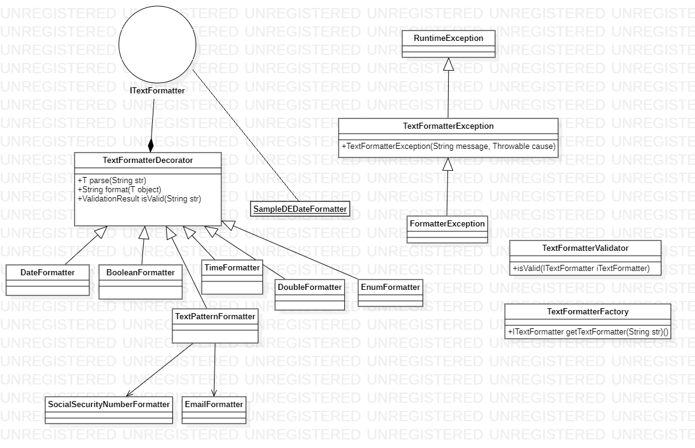

zoolcoder-text-formatter
===================================

This project is a small framework around turning objects into text and vice versa.

## UML Class diagram ##

## additional Classes ##
* TextFormatterFactory: factory class to recommend which formatter class you can use depends on the provided string. 
* TextFormatterValidator: combinator interface to support validation chain. 

### zoolcoder-text-formatter-samples: ###
this project is sample project to show how you can use the framework and extended.
* EmailFormatter: class sample to extend existing formatter
* SocialSecurityNumberFormatter: class sample to extend existing formatter
* SampleDEDateFormatter: sample to implement ITextFormatter. 

### Notes ###

Maven has been used as a build tool in this project.

"mvn clean package" or "mvn package" can be used to create an executable jar.
